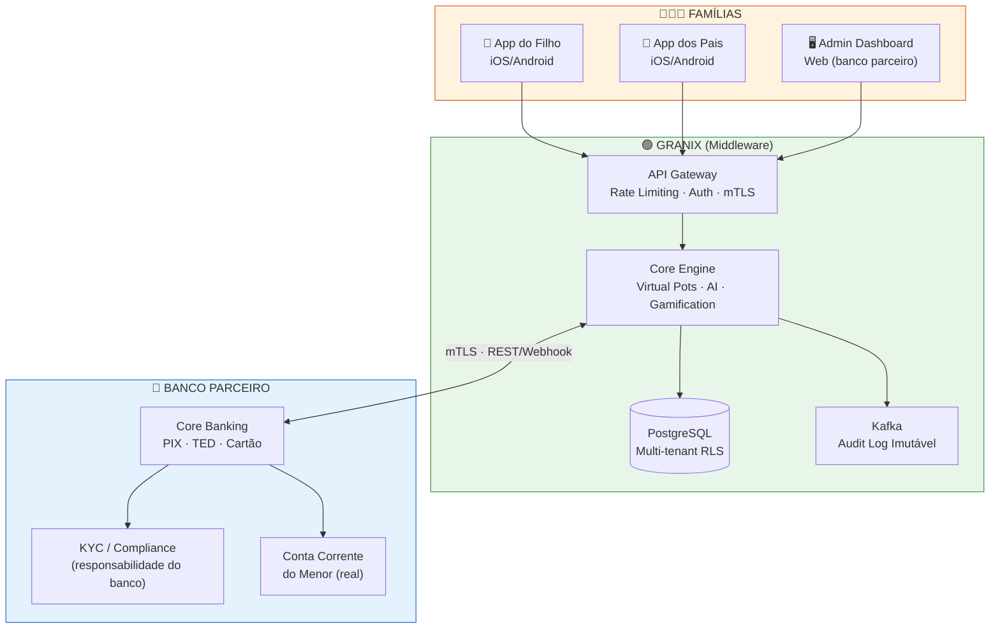
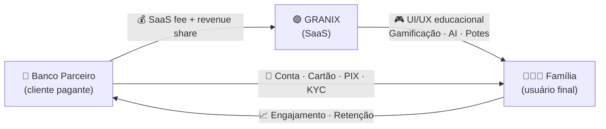
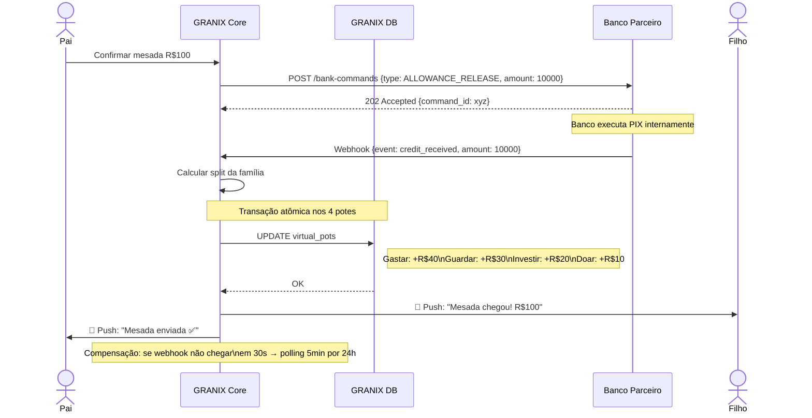
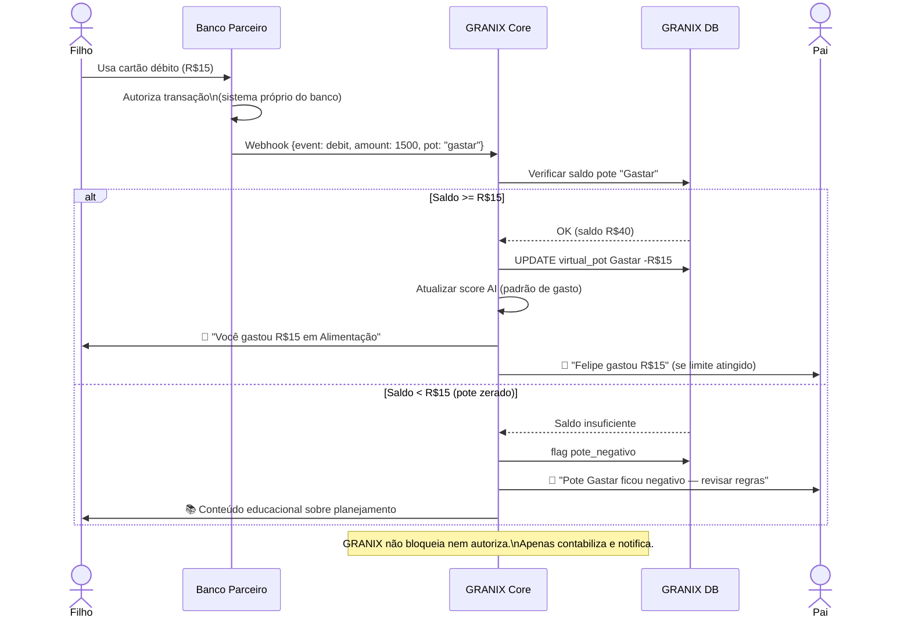
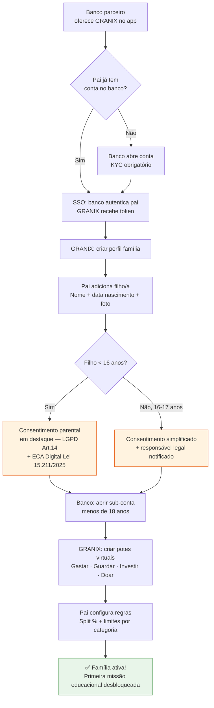
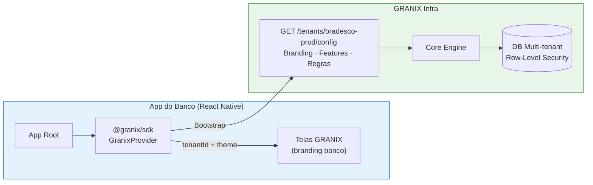
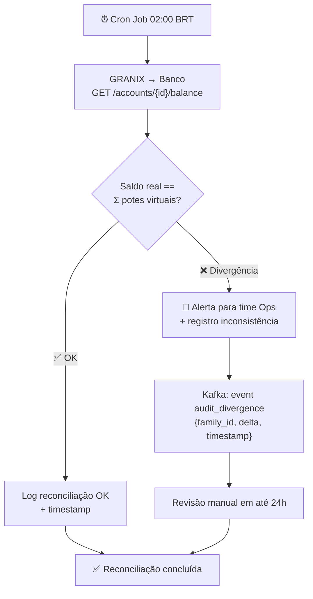
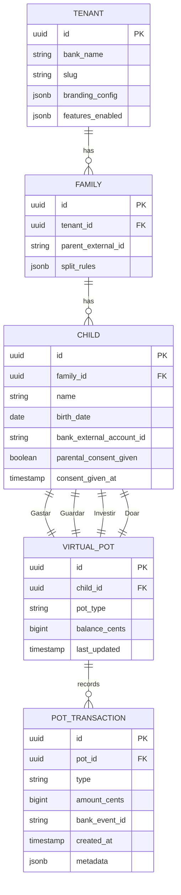

# GRANIX — Diagramas de Fluxo

> **Versão:** 1.0 | **Data:** Abril 2026
> **Formato:** Mermaid (renderiza no GitHub, Notion, GitBook)

---

## 1. Arquitetura de Sistema — Visão Geral (C4 Nível Sistema)

**Princípio:** GRANIX orquestra comandos ao banco — nunca toca no dinheiro diretamente.

---

## 2. Modelo B2B2C — Fluxo Comercial

---

## 3. Fluxo de Alocação de Mesada (Saga Pattern)

---

## 4. Fluxo de Gasto (Compra com Cartão)

---

## 5. Fluxo de Onboarding — Família + Banco

---

## 6. Fluxo Multi-tenant — Deploy SDK no Banco

---

## 7. Fluxo de Reconciliação Diária (02h BRT)

---

## 8. Modelo de Dados — Potes Virtuais

